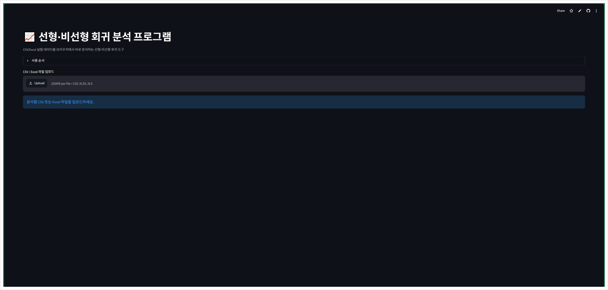
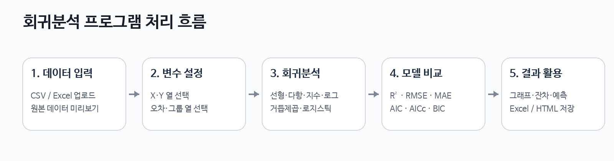
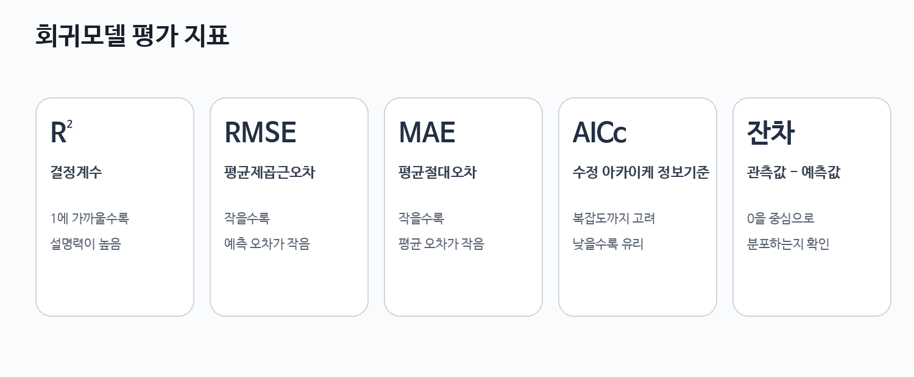
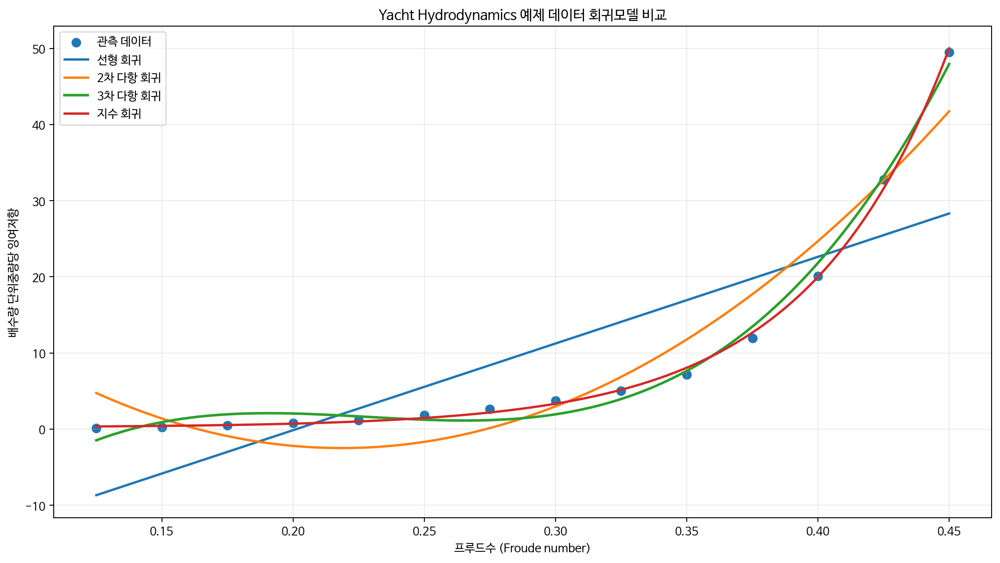

<div align="center">

# 선형·비선형 회귀분석 프로그램

**CSV/Excel 실험 데이터를 이용해 여러 회귀모델을 비교하고, 그래프·잔차·통계지표·예측 결과를 확인할 수 있는 웹 기반 분석 도구**

`Python` · `Streamlit` · `NumPy` · `Pandas` · `SciPy` · `Plotly`

</div>

---

## 프로그램 화면

<p align="center">
  
</p>

브라우저에서 CSV 또는 Excel 파일을 업로드한 뒤 독립변수(X), 종속변수(Y), 분석할 회귀모델을 선택하여 바로 회귀분석을 수행할 수 있습니다.

---

## 프로그램 처리 흐름

<p align="center">
  
</p>

데이터 입력부터 변수 설정, 회귀계산, 모델 비교, 결과 저장까지 하나의 프로그램에서 연속적으로 수행하도록 구성하였습니다.

---

## 1. 프로그램 개발 목적

실험 및 공학 데이터는 항상 직선 형태의 관계를 가지지 않습니다. 따라서 단순한 선형회귀만으로는 데이터의 경향을 충분히 설명하기 어려운 경우가 있습니다.

본 프로그램은 하나의 데이터에 여러 선형·비선형 회귀모델을 적용하고 결과를 비교하여 다음 내용을 확인할 수 있도록 제작하였습니다.

- 선형회귀 및 비선형 회귀곡선 확인
- 여러 회귀모델의 적합도 비교
- 잔차를 이용한 오차 분석
- 이상치 후보 확인
- 새로운 X 값에 대한 Y 값 예측
- 분석 결과 Excel 및 HTML 저장

---

## 2. 주요 기능

| 구분 | 기능 |
|---|---|
| 데이터 입력 | CSV, XLSX, XLS 파일 업로드 |
| 데이터 확인 | 원본 데이터 및 적용 데이터 미리보기 |
| 변수 설정 | X, Y, Y 오차, 사례/그룹 열 선택 |
| 회귀모델 | 선형, 2차, 3차, 지수, 로그, 거듭제곱, 4-모수 로지스틱 |
| 그래프 | 관측 데이터와 회귀곡선 비교, 95% 신뢰구간 |
| 오차 분석 | 잔차 그래프, 이상치 후보 표시 |
| 모델 비교 | R², 수정 R², RMSE, MAE, SSE, AIC, AICc, BIC |
| 예측 | 최적 모델을 이용한 새로운 X 값의 Y 값 예측 |
| 결과 저장 | Excel 분석 결과 및 Plotly HTML 그래프 저장 |

---

## 3. 지원 회귀모델

| 회귀모델 | 기본 형태 | 특징 |
|---|---|---|
| 선형 회귀 | `y = ax + b` | X-Y 관계를 직선으로 근사 |
| 2차 다항 회귀 | `y = ax² + bx + c` | 완만한 곡률이 있는 데이터 |
| 3차 다항 회귀 | `y = ax³ + bx² + cx + d` | 더 복잡한 곡률 변화 |
| 지수 회귀 | `y = a·exp(bx) + c` | 빠르게 증가·감소하는 데이터 |
| 로그 회귀 | `y = a·ln(x) + b` | 증가폭이 점차 감소하는 데이터 |
| 거듭제곱 회귀 | `y = a·xᵇ` | 스케일 관계 및 공학적 비선형 관계 |
| 4-모수 로지스틱 | S자 곡선 | 상·하한을 가지는 S자 형태 |

> 로그 및 거듭제곱 회귀는 현재 프로그램에서 `X > 0`인 데이터에 적용합니다.

---

## 4. 개발 환경

| 항목 | 내용 |
|---|---|
| 운영체제 | Windows 10 / Windows 11 권장 |
| Python | Python 3.10 ~ 3.12 권장 |
| 실행 방식 | Streamlit 웹 애플리케이션 |
| 웹브라우저 | Chrome, Edge 등 최신 브라우저 |

Python 설치 확인:

```bash
python --version
```

pip 확인:

```bash
python -m pip --version
```

---

## 5. 필요한 Python 라이브러리

프로그램 실행에 필요한 외부 라이브러리는 `requirements.txt`에 정리되어 있습니다.

```txt
streamlit>=1.42
numpy>=1.24
pandas>=2.0
scipy>=1.10
plotly>=5.20
openpyxl>=3.1
xlrd>=2.0
```

| 라이브러리 | 프로그램에서의 역할 |
|---|---|
| `streamlit` | 웹 화면, 파일 업로드, 입력창, 버튼, 다운로드 기능 |
| `numpy` | 배열 연산 및 다항 회귀 계산 |
| `pandas` | CSV/Excel 입력, 데이터 전처리, 결과 표 생성 |
| `scipy` | 비선형 회귀 최적화와 통계 계산 |
| `plotly` | 인터랙티브 회귀·잔차 그래프 |
| `openpyxl` | XLSX 파일 읽기 및 결과 Excel 저장 |
| `xlrd` | XLS 파일 읽기 |

Python 기본 라이브러리인 `io`, `math`, `dataclasses`, `typing`도 사용하지만 별도 설치는 필요하지 않습니다.

---

## 6. 설치 및 실행

### 6.1 라이브러리 설치

프로그램 폴더에서 다음 명령을 실행합니다.

```bash
python -m pip install -r requirements.txt
```

직접 설치하려면 다음 명령을 사용할 수 있습니다.

```bash
python -m pip install streamlit numpy pandas scipy plotly openpyxl xlrd
```

### 6.2 가상환경 사용

다른 Python 프로젝트와의 라이브러리 충돌을 줄이기 위해 가상환경 사용을 권장합니다.

```bash
python -m venv .venv
.venv\Scripts\activate
python -m pip install --upgrade pip
python -m pip install -r requirements.txt
```

### 6.3 프로그램 실행

```bash
python -m streamlit run Regression_Analyzer_Web.py
```

정상적으로 실행되면 브라우저에서 프로그램이 열립니다.

```text
http://localhost:8501
```

종료할 때는 실행 중인 명령 프롬프트에서 `Ctrl + C`를 누릅니다.

---

## 7. 데이터 준비

가장 기본적인 형태는 X와 Y가 각각 하나의 숫자 열로 존재하는 구조입니다.

| Froude_Number | Residuary_Resistance_per_Displacement |
|---:|---:|
| 0.125 | 0.11 |
| 0.150 | 0.27 |
| 0.175 | 0.47 |
| 0.200 | 0.78 |
| 0.225 | 1.18 |

- **X 열**: 독립변수 — 속도, 시간, 압력, 프루드수 등
- **Y 열**: 종속변수 — 저항, 효율, 온도, 면적비율 등
- **Y 오차 열**: 표준편차나 측정오차가 존재할 때 선택
- **사례/그룹 열**: 여러 실험 조건을 한 파일에서 각각 분석할 때 선택

현재 Y 오차 열은 그래프의 오차막대 표시용이며 회귀계수 계산의 가중치에는 사용하지 않습니다.

---

## 8. 사용 방법

1. CSV 또는 Excel 파일을 업로드합니다.
2. Excel 파일인 경우 분석할 시트를 선택합니다.
3. 열 제목이 있는 행을 확인합니다.
4. X 열과 Y 열을 선택합니다.
5. 필요한 경우 Y 오차 열과 사례/그룹 열을 선택합니다.
6. 분석할 회귀모델을 선택합니다.
7. **회귀 분석 실행** 버튼을 누릅니다.
8. 회귀 그래프와 모델 결과를 확인합니다.
9. **알고리즘** 탭에서 실제 계산 절차를 확인합니다.
10. 잔차 그래프와 이상치 후보를 확인합니다.
11. 필요한 경우 새로운 X 값을 입력하여 Y 값을 예측합니다.
12. 분석 결과를 Excel 또는 HTML로 저장합니다.

---

## 9. 프로그램 알고리즘

전체 처리 순서는 다음과 같습니다.

```text
데이터 입력
→ Header 적용 및 X/Y 숫자 변환
→ 결측/비수치 제거
→ 회귀모델 적합
→ 예측값 및 잔차 계산
→ R², RMSE, MAE, AIC/AICc/BIC 계산
→ AICc(불가 시 AIC) 기준 최고 모델 선택
→ 이상치·95% 신뢰구간 확인
→ 예측 및 결과 저장
```

### 선형·2차·3차 다항 회귀

NumPy의 `polyfit`을 이용한 **최소제곱 적합**을 사용합니다. 관측값 `y`와 예측값 `ŷ` 사이의 잔차제곱합 `SSE = Σ(y-ŷ)²`가 최소가 되도록 회귀계수를 계산합니다.

2차·3차 다항회귀는 그래프는 곡선이지만 회귀계수에 대해서는 선형인 다항모델입니다.

### 지수·로그·거듭제곱·4-모수 로지스틱 회귀

SciPy의 `curve_fit`을 사용하여 **비선형 최소제곱 최적화**를 수행합니다. 프로그램은 초기 파라미터를 설정한 뒤 `method="trf"`의 Trust Region Reflective 방식으로 반복 최적화합니다. 로그·거듭제곱 회귀는 `X > 0` 데이터만 사용합니다.

### 모델 평가 및 선택

모델 적합 후 R², 수정 R², RMSE, MAE, SSE, AIC, AICc, BIC를 계산합니다. 최고 모델은 **AICc가 가장 낮은 모델**, AICc 계산이 불가능한 경우 **AIC가 가장 낮은 모델**로 결정합니다.

### 잔차·이상치·신뢰구간

잔차는 `관측값 - 예측값`으로 계산하고, `|표준화 잔차| ≥ 2`인 점을 이상치 후보로 표시합니다. 95% 신뢰구간은 파라미터 공분산, 수치 Jacobian, Student t 분포를 이용해 근사합니다.

---

## 10. 모델 평가 지표

<p align="center">
  
</p>

### 결정계수 R²
모델이 Y 데이터의 변동을 어느 정도 설명하는지 나타냅니다. 일반적으로 1에 가까울수록 데이터에 잘 맞습니다.

### 수정 결정계수
모델의 파라미터 수를 고려하여 결정계수를 보정합니다.

### 평균제곱근오차 RMSE

```text
RMSE = sqrt(mean((Y - Ŷ)²))
```

값이 작을수록 관측값과 예측값의 차이가 작습니다.

### 평균절대오차 MAE

```text
MAE = mean(|Y - Ŷ|)
```

값이 작을수록 평균적인 예측 오차가 작습니다.

### 잔차제곱합 SSE

```text
SSE = Σ(Y - Ŷ)²
```

값이 작을수록 데이터에 더 가깝게 적합된 것입니다.

### AIC / AICc / BIC
모델의 적합도뿐 아니라 모델의 복잡도도 함께 고려합니다.

본 프로그램에서는 계산 가능한 경우 **AICc가 가장 낮은 모델을 최적 모델로 표시**하며, AICc를 계산할 수 없는 경우 AIC를 사용합니다.

> R²가 가장 높은 모델과 AICc가 가장 낮은 모델은 서로 다를 수 있습니다. 복잡한 모델은 데이터에 매우 가깝게 맞더라도 과적합 가능성이 있기 때문입니다.

---

## 11. 잔차와 이상치 후보

잔차는 다음과 같이 정의합니다.

```text
잔차 = 관측값 - 예측값
```

잔차가 0에 가까울수록 해당 데이터에서 실제 관측값과 모델 예측값이 가깝다는 뜻입니다.

이상치 후보는 표준화 잔차를 이용해 다음 기준으로 표시합니다.

```text
|표준화 잔차| ≥ 2
```

이 기준을 만족한다고 해서 해당 데이터를 자동으로 제거하지 않습니다. 측정오차, 센서 이상, 실제 물리적 현상 등 원인을 확인한 후 사용자가 판단해야 합니다.

---

## 12. 95% 신뢰구간

최적 회귀모델에 대해 95% 신뢰구간을 표시할 수 있습니다.

적합된 파라미터의 공분산과 t 분포를 이용하여 회귀곡선의 파라미터 불확실성을 근사합니다.

---

## 13. 예측 기능

회귀분석 후 새로운 X 값을 입력하면 각 사례/그룹의 최적 모델을 이용하여 Y 값을 계산합니다.

단, 실험 범위를 크게 벗어나는 X 값을 입력하면 **외삽**이 되므로 실제 현상과의 차이가 커질 수 있습니다.

---

## 14. 결과 저장

### Excel 결과
분석 결과를 `.xlsx` 형식으로 저장할 수 있으며 다음 항목을 포함합니다.

- 모델 요약
- 모델 파라미터
- 전체 예측값
- 최적 모델 잔차
- 입력 데이터
- 분석 실패 모델 정보

### HTML 그래프
Plotly 회귀 그래프를 HTML 파일로 저장할 수 있습니다. 브라우저에서 확대, 축소, 마우스 오버 정보 확인이 가능합니다.

---

## 15. 선박 유체역학 예제 데이터

`sample_data.csv`는 **UCI Machine Learning Repository의 Yacht Hydrodynamics 공개 데이터셋**에서 가져온 선박 유체역학 실험 데이터 일부입니다.

동일한 선형 조건에서 프루드수 증가에 따른 잉여저항 변화를 회귀분석할 수 있도록 구성했습니다.

### 권장 분석 설정

```text
X 열 : Froude_Number
Y 열 : Residuary_Resistance_per_Displacement
```

### 예제 데이터 회귀모델 비교

<p align="center">
  
</p>

이 예제에서는 속도에 대응하는 프루드수가 증가함에 따라 잉여저항이 비선형적으로 증가하므로, 선형회귀와 비선형 회귀모델의 차이를 확인하기에 적합합니다.

### 데이터 열

| 열 이름 | 의미 |
|---|---|
| `LCB_Position` | 부심의 종방향 위치 |
| `Prismatic_Coefficient` | 주형계수 |
| `Length_Displacement_Ratio` | 길이-배수량 비 |
| `Beam_Draught_Ratio` | 폭-흘수 비 |
| `Length_Beam_Ratio` | 길이-폭 비 |
| `Froude_Number` | 프루드수 |
| `Residuary_Resistance_per_Displacement` | 배수량 단위중량당 잉여저항 |

### 데이터 출처

Gerritsma, J., Onnink, R., & Versluis, A. (1981). *Yacht Hydrodynamics*. UCI Machine Learning Repository.  
자료 식별번호: `10.24432/C5XG7R`

---

## 16. 프로젝트 구성

```text
Regression-Analysis-Tool/
│
├── Regression_Analyzer_Web.py
├── requirements.txt
├── README.md
├── sample_data.csv
└── assets/
    ├── program_ui.png
    ├── workflow.png
    ├── metrics_guide.png
    └── regression_example.png
```

---

## 17. 오류 해결

### requirements.txt를 찾을 수 없는 경우

```text
ERROR: Could not open requirements file:
[Errno 2] No such file or directory: 'requirements.txt'
```

프로그램 파일이 있는 폴더로 이동한 뒤 다시 실행합니다.

```bash
cd C:\Users\USER\Downloads\Regression-Analysis-Tool
python -m pip install -r requirements.txt
```

### Streamlit 실행 명령이 인식되지 않는 경우

```bash
python -m streamlit run Regression_Analyzer_Web.py
```

### 라이브러리 버전 충돌이 발생하는 경우

가상환경에서 새로 설치하는 것을 권장합니다.

```bash
python -m venv .venv
.venv\Scripts\activate
python -m pip install -r requirements.txt
```

### 로그·거듭제곱 회귀가 실패하는 경우

X 데이터에 0 또는 음수가 포함되어 있는지 확인합니다.

---

## 18. 프로그램 요약

본 프로그램은 실험 데이터를 입력받아 여러 선형·비선형 회귀모델을 적용하고 회귀곡선과 통계지표를 비교할 수 있도록 제작한 웹 기반 데이터 분석 도구입니다.

단순히 회귀곡선을 출력하는 것뿐 아니라 **최소제곱/비선형 최소제곱 알고리즘 설명, 잔차 분석, 이상치 후보 검출, 95% 신뢰구간, 모델 선택, 예측, 결과 저장**을 하나의 프로그램에서 수행할 수 있도록 구성하였습니다.
